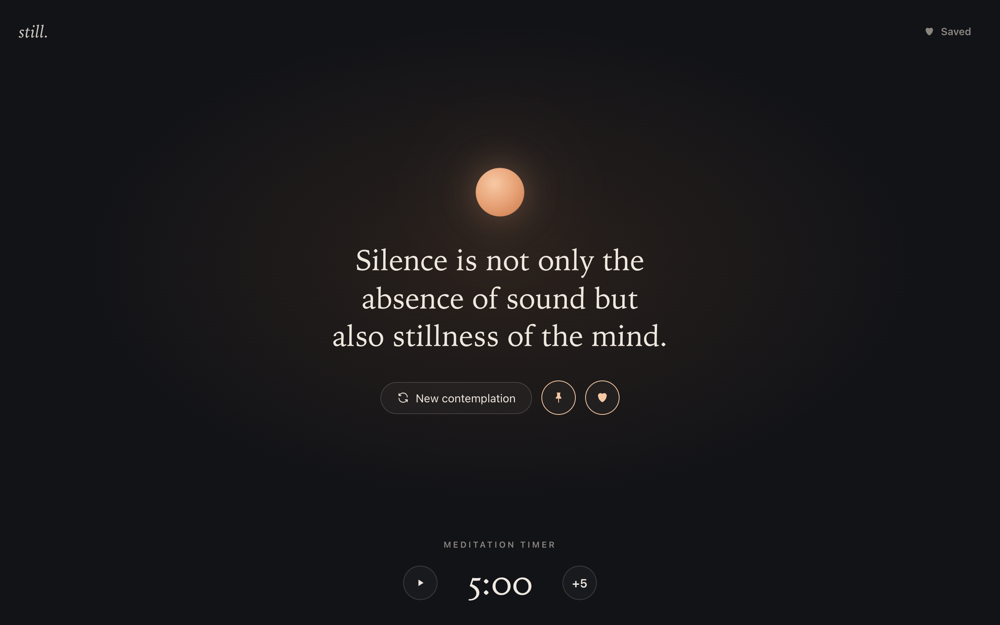
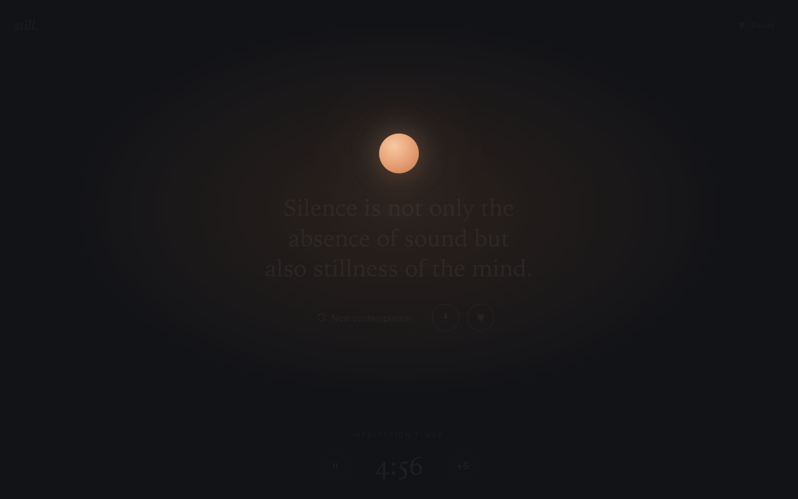
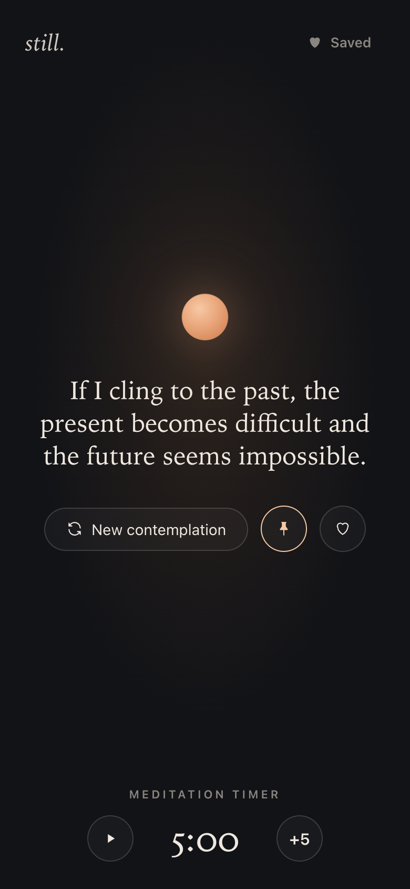
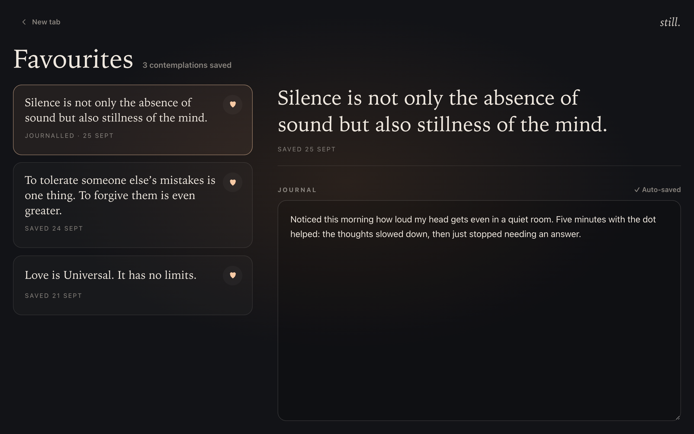

# still.

A quiet new tab for Chrome. Every new tab shows a short contemplation, a softly breathing orb to rest your eyes on, and a meditation timer that ends with a gong.

## Features

- **A contemplation on every tab.** Each new tab draws a different one from a shuffled deck, so you see them all before any repeats. Use **New contemplation** to draw another.
- **Pin for today.** Pin a contemplation to keep it on every new tab until midnight.
- **A dot to focus on.** The orb breathes slowly in the centre of the page.
- **Meditation timer.** It starts at 5 minutes, and **+5** adds more. While it runs, everything except the orb fades almost to nothing. A synthesised gong marks the end, even if the tab is in the background.
- **Favourites and journal.** Heart a contemplation to save it, then write about it on the favourites page. Notes save as you type.

| Meditating | Mobile |
| --- | --- |
|  |  |

## Install

still. isn't in the Chrome Web Store yet. To install it from source:

1. Clone or download this repository.
2. Open `chrome://extensions` and turn on **Developer mode**.
3. Click **Load unpacked** and choose the repository folder.
4. Open a new tab.

## Privacy

still. has no accounts, analytics or network requests. Favourites, journal entries and your pinned contemplation are stored only in your browser's `localStorage`, and the extension requests no permissions.

## Contemplations

The contemplations are Brahma Kumaris "Thought for Today" messages, transcribed word for word from [shivbabas.org](https://www.shivbabas.org/thoughts). They're stored in [`contemplations.json`](contemplations.json). The collection currently covers June to mid-September 2026 and leaves out thoughts that refer to God.

## Development

There's no build step and there are no dependencies. The extension is plain HTML, CSS and JavaScript.

- After editing, reload the extension in `chrome://extensions`.
- To work on it in an ordinary browser tab, run `python3 -m http.server` in this folder and open `http://localhost:8000/newtab.html`. Opening the files directly with `file://` won't work, because the contemplations are loaded with `fetch`.
- [CLAUDE.md](CLAUDE.md) describes the architecture, how state is stored, and the rules for adding contemplations.
- `node scripts/make-icons.mjs` regenerates the icons in `icons/`.
- To release, bump `version` in `manifest.json`, commit, then push a matching tag (`git tag v0.1.0 && git push origin v0.1.0`). A GitHub Action builds the Web Store upload, `still-<version>.zip`, containing only the files the extension loads, and attaches it to a GitHub Release. `scripts/package.sh` builds the same zip locally in `dist/`. Listing copy, privacy answers and the pre-submission notes are in [CHROMEWEBSTORE.md](CHROMEWEBSTORE.md), and the privacy policy is in [PRIVACY.md](PRIVACY.md).
